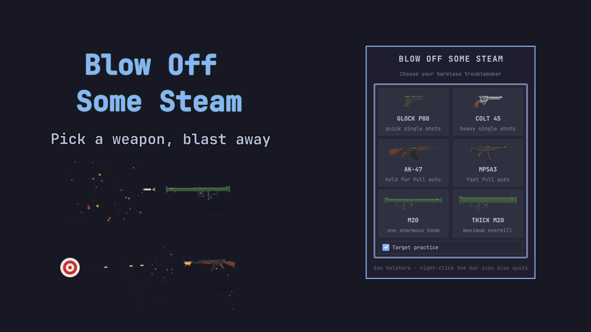

# Blow off some steam

A playful Omarchy Shell bar widget. Open the animated weapon wardrobe and choose one of six harmless weapons, with optional desktop destruction.



## Requirements

- Omarchy with Quickshell plugin support.
- `grim` for capturing the monitor where the weapon case was opened (included with Omarchy).
- No additional runtime dependencies; all artwork and sounds are bundled.

## Controls

- Click the bar icon to open the weapon case.
- Choose the **Glock P80**, **Colt 45**, **AK-47**, **MP5A3**, **M20 Bazooka**, or **Thick M20**.
- Check **Desktop destruction** to freeze the current monitor into a safe, destructible playground after choosing a weapon. It is off by default, and your real windows and files remain untouched.
- Click to fire. Hold with the AK-47 or MP5A3 for automatic fire.
- Right-click while armed to spin the weapon once around its grip.
- Hold the middle mouse button, drag toward a weapon in the hexagonal wheel, and release to switch. Keyboard users can hold **Q**, select with arrow keys, and release; number keys **1–6** or **Enter** also choose while the wheel is open.
- Glock, Colt, AK-47, and MP5 rounds remain visible and ricochet off screen edges with damped momentum.
- Ejected casings tumble and bounce independently when they reach a screen edge.
- **Target practice** is off by default. Check it in the drawer to spawn a roaming bullseye; hit it to dissolve it into smoke and relocate it.
- **Target practice** and **Desktop destruction** are mutually exclusive; enabling either one automatically disables the other.
- Rockets ricochet from screen edges and burst when the launcher recording reaches its explosion; direct hits detonate immediately, and the full blast radius can hit targets.
- Bullet impacts leave persistent holes and cracks; rocket explosions scorch much larger areas of the captured desktop.
- Press **Escape**, or right-click the bar icon after returning to it, to holster.

While armed, the fullscreen overlay intentionally captures pointer input so shots do not click the windows underneath it.

Desktop destruction stores its frozen frame as an owner-only temporary file under `/tmp`. The file is removed when the weapon is holstered; an abnormal shell termination may leave it for the system's normal temporary-file cleanup.

## Install

```bash
omarchy plugin add https://github.com/ejuro/blow-off-some-steam.git --enable
```

## Remove

```bash
omarchy plugin remove io.github.ejuro.blow-off-some-steam
```

## Validate

```bash
omarchy plugin validate .
```

## Third-party artwork

Weapon sprites are from [GUNS V1.01 by Arcade Island](https://arcadeisland.itch.io/guns-asset-pack-v1), used and modified under the terms published on that page. The sprites under `assets/` are not covered by this plugin's MIT license. Arcade Island permits use and modification in personal and commercial projects, but does not permit reselling the assets individually or redistributing them as your own creation.

## Third-party sounds

The processed sounds under `sounds/` are derived from the following Pixabay downloads and are used under the [Pixabay Content License](https://pixabay.com/service/license-summary/):

- “FX GUN PISTOL Glock 19x” by Substancial
- “AK-47 Sound Effect” by Red_Army_Soviet
- “RPG-7 Sound Effect” by Sovetsky_Rastov72
- “Single Pistol Gunshot 3.3” by morganpurkis (via freesound_community)
- “MP5” by jigokukarano_sisya
- “Load Gun sound effect 5” by beetpro
- “Window Breaking” by m1a2t3z4 (via freesound_community)

These audio files are not covered by this plugin's MIT license. See `sounds/README.md` for source links and details.
