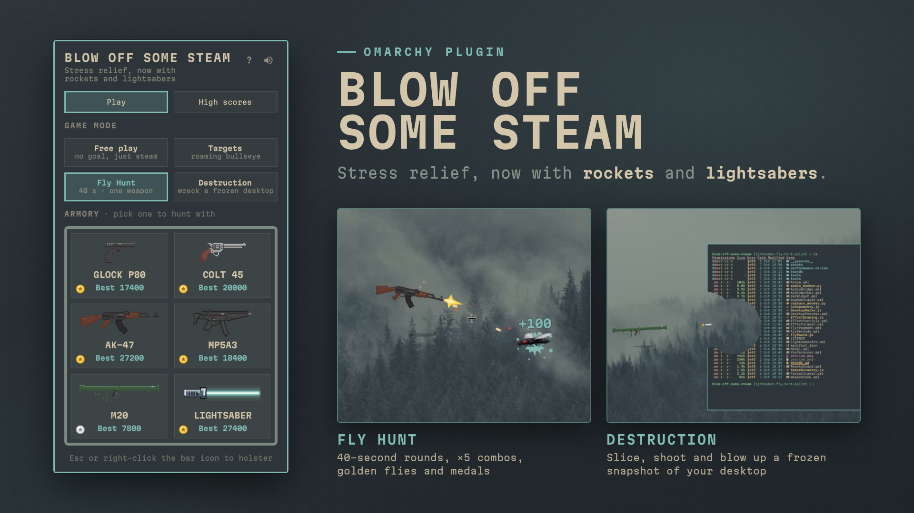

# Blow off some steam

A playful Omarchy bar widget. Open the weapon case, pick one of six weapons, and wreck your desktop without harming it: shoot targets, hunt flies against the clock, or slice, shoot and blow up a frozen snapshot of your screen.



## Weapons

- **Glock P80**: quick and precise.
- **Colt 45**: hits hardest, and its rounds punch through every fly in line.
- **AK-47**: full auto. The muzzle climbs and shots spread the longer you hold.
- **MP5A3**: a tight 3-round burst per click.
- **M20 bazooka**: a big blast whose shockwave flings nearby flies.
- **Lightsaber**: hold to ignite, then move to cut. It slices flies in half and cuts windows apart in Destruction.

## Game modes

- **Free play**: no goal, just steam.
- **Targets**: a roaming bullseye to hit.
- **Fly Hunt**: 40 seconds with one weapon. Quick kills build a ×5 combo, golden flies are worth ×3, and time's up ends in slow-motion bullet time for one last kill. Every weapon keeps its own high score and earns bronze to platinum medals.
- **Destruction**: freezes the current monitor into a picture you can shoot holes in, cut with the saber, and blow apart. Windows fall when they break.

## Controls

| Input | Action |
| --- | --- |
| Left click | Fire (hold the AK for full auto; hold the saber to light it) |
| Right click | Spin your weapon |
| Middle click or hold **Q** | Weapon wheel (also 1–6); not in Fly Hunt |
| **Esc** or right-click the bar icon | Holster |

The **?** button in the case explains the controls and modes, and the speaker button turns sound on or off.

## Install

```bash
omarchy plugin add https://github.com/erikrjohansson/blow-off-some-steam.git --enable
```

## Remove

```bash
omarchy plugin remove io.github.ejuro.blow-off-some-steam
```

## Requirements

Omarchy with Quickshell plugin support. Desktop capture uses `grim`, and sound uses `/usr/bin/python3` and `/usr/bin/qs`; all are included with Omarchy. All artwork and sounds are bundled.

## Safety and privacy

- Your real windows and files are never touched. While armed, a fullscreen overlay catches the mouse so clicks do not reach the windows underneath.
- Destruction captures only the monitor you are on, into a private (mode `0600`) file in your session's runtime directory. The file is deleted when you holster.
- Sound plays in a separate process, so an audio crash cannot take down the bar. Helper programs run from fixed `/usr/bin` paths with a cleared environment.
- High scores and the sound setting are saved in `~/.local/state/blow-off-some-steam/`. Nothing is sent anywhere.

## Credits

The five gun sprites are from [GUNS V1.01 by Arcade Island](https://arcadeisland.itch.io/guns-asset-pack-v1), used and modified under that page's terms. They are not covered by this plugin's MIT license. The fly sprite sheet was generated with OpenAI's image model and edited for this plugin; it is covered by the MIT license.

The gun, explosion, window-break and splat sounds are edited from Pixabay downloads by Substancial, Red_Army_Soviet, Sovetsky_Rastov72, morganpurkis, jigokukarano_sisya, beetpro, m1a2t3z4 and Universfield, used under the [Pixabay Content License](https://pixabay.com/service/license-summary/). They are not covered by this plugin's MIT license. The lightsaber and Fly Hunt sounds are original and MIT. See [`sounds/README.md`](sounds/README.md) and [`assets/README.md`](assets/README.md) for details.

## Development

`omarchy plugin validate .` checks the manifest. Tests: `node tests/*.cjs`, plus `python3 tests/<name>.py` for security, audio, process launches, Fly Hunt and the in-shell weapon checks (`weapon-runtime.py` needs a desktop session).
